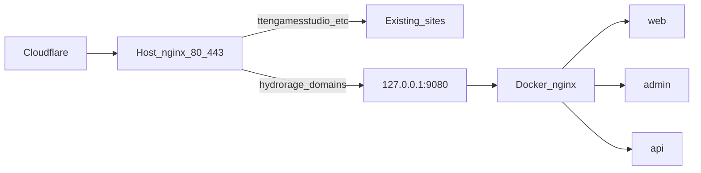

# Production deploy (VPS + GHCR + Cloudflare)

HydroRage production stack:

| Host | Service |
|---|---|
| `https://hydrorage.com.tr` | Landing (`web`) |
| `https://admin.hydrorage.com.tr` | Admin panel |
| `https://api.hydrorage.com.tr` | NestJS API |

Node **26.9.0** · Yarn **4.18.0**.

## Shared VPS (do not break other sites)

This server already serves other live domains (e.g. `ttengamesstudio.com.tr`, `emrekilic.web.tr`, `kiliccoffeeroaster.com.tr`). HydroRage is designed to **coexist**:

| Rule | Detail |
|---|---|
| No steal of `:80` / `:443` | Docker nginx binds **`127.0.0.1:9080` only** (`HTTP_BIND`) |
| No public DB ports | Postgres / PgBouncer / Redis stay on the private `hydrorage_net` bridge |
| Host edge unchanged | Existing nginx/Caddy vhosts for other domains are **not** edited by deploy |
| HydroRage hostnames only | One extra host vhost proxies `hydrorage*` → `127.0.0.1:9080` |



## Architecture

1. GitHub Actions builds and pushes `hydrorage-{api,web,admin}` to GHCR.
2. SSH deploy runs [`deploy/zero-downtime.sh`](../deploy/zero-downtime.sh) (blue/green API).
3. Host nginx routes only HydroRage `server_name`s to the Docker edge.

## Cloudflare DNS

Create **proxied** records pointing at the **same** VPS IP as your other sites:

- `A` / `AAAA` `hydrorage.com.tr` → VPS IP
- `A` / `AAAA` `www` → VPS IP (optional)
- `A` / `AAAA` `api` → VPS IP
- `A` / `AAAA` `admin` → VPS IP

Do **not** change DNS for the other live domains.

SSL/TLS: **Flexible** (origin HTTP on host `:80`) or **Full** after certbot on the HydroRage vhost.

## Server bootstrap (once)

```bash
sudo mkdir -p /opt/hydrorage
sudo chown "$USER":"$USER" /opt/hydrorage
cd /opt/hydrorage
git clone git@github.com:YOUR_ORG/hydrorage.git .

cp .env.prod.example .env
# Edit .env — keep HTTP_BIND=127.0.0.1:9080
# Sync docker/pgbouncer/* passwords with POSTGRES_PASSWORD

echo "$GHCR_TOKEN" | docker login ghcr.io -u YOUR_USER --password-stdin
chmod +x deploy/*.sh

# 1) Start stack (does NOT bind public :80)
./deploy/bootstrap.sh latest

# 2) Add ONLY hydrorage hostnames to host nginx (other sites untouched)
sudo ./deploy/install-host-nginx.sh
```

If the edge is **Caddy**, skip `install-host-nginx.sh` and merge [`docker/nginx/host/Caddyfile.hydrorage.snippet`](../docker/nginx/host/Caddyfile.hydrorage.snippet) into your Caddyfile, then `caddy reload`.

Verify without touching other hosts:

```bash
curl -sI -H 'Host: api.hydrorage.com.tr' http://127.0.0.1:9080/api/health
curl -sI https://api.hydrorage.com.tr/api/health
# Other sites still OK:
curl -sI https://ttengamesstudio.com.tr
curl -sI https://emrekilic.web.tr
curl -sI https://kiliccoffeeroaster.com.tr
```

## GitHub Secrets / Environment

Create environment **`production`**:

| Secret | Purpose |
|---|---|
| `DEPLOY_HOST` | VPS IP or hostname |
| `DEPLOY_USER` | SSH user |
| `DEPLOY_SSH_KEY` | Private key (full PEM) |
| `GHCR_TOKEN` | PAT `read:packages` (optional if already logged in on server) |
| `GHCR_USERNAME` | GitHub username for `docker login` |

SSH port is **22** in [`.github/workflows/deploy.yml`](../.github/workflows/deploy.yml).

Workflows: `ci.yml` (PR/main), `deploy.yml` (`main` → GHCR → zero-downtime SSH).

Deploy updates only `/opt/hydrorage` containers + the HydroRage upstream file inside Docker. It does **not** rewrite other sites’ nginx configs.

## Local image build (optional)

```bash
docker build -f apps/api/Dockerfile -t hydrorage-api .
docker build -f apps/web/Dockerfile -t hydrorage-web \
  --build-arg VITE_API_URL=https://api.hydrorage.com.tr/api \
  --build-arg VITE_ADMIN_URL=https://admin.hydrorage.com.tr .
docker build -f apps/admin/Dockerfile -t hydrorage-admin \
  --build-arg VITE_API_URL=https://api.hydrorage.com.tr/api \
  --build-arg VITE_LANDING_URL=https://hydrorage.com.tr .
```

## Next: iOS / Android

EAS Build after web/api/admin are live (`eas.json` + mobile workflow); API base `https://api.hydrorage.com.tr/api`.
